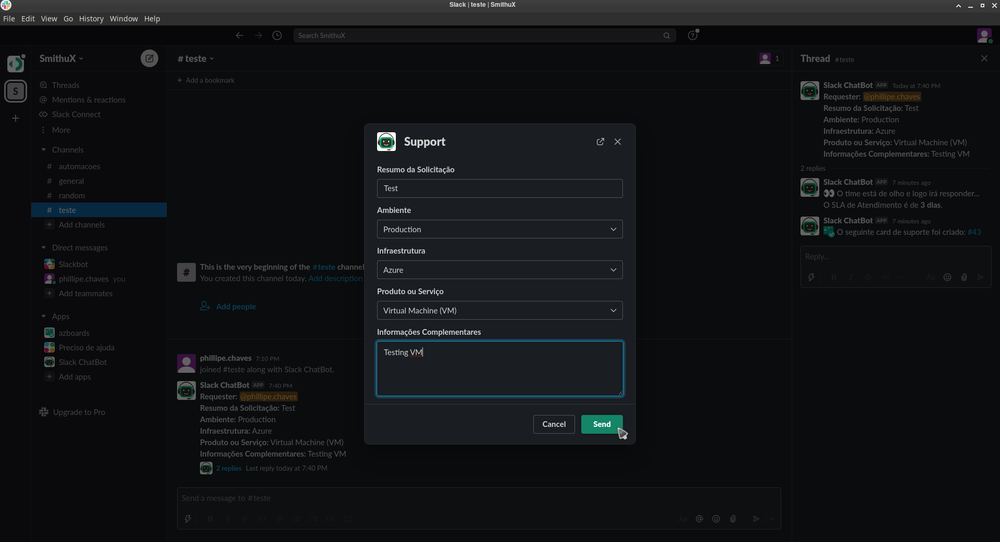

# slack-chatbot

Slack ChatBot with shortcuts forms support and Azure Boards integration.



## Code Structure

- **bot**: source code main directory
- **handlers**: source for manage libs events like a new message received
- **libs**: source for third party libs like slack-bolt Slack client
- **templates**: Bot templates like Slack modal views, see [Block Kit Builder](https://app.slack.com/block-kit-builder), and AzureDevops payloads
- **tests**: source for code unit tests
- **config.py**: file that manages bot base configurations
- **main.py**: file that starts all necessary codes to run the bot
- **requirements.txt**: file with python required libs to run the bot
- **Dockerfile**: file to build a docker container to run the bot

```
.
├── bot
│   ├── handlers
│   │   └── slack
│   │       ├── handle_messages.py
│   │       └── handle_shortcut_support.py
│   ├── libs
│   │   ├── az_devops_client.py
│   │   └── slack_client.py
│   ├── templates
│   │   ├── azure_devops
│   │   │   └── inf-core-dc-compute.j2
│   │   └── slack
│   │       └── infra_compute_shortcut_support.json
│   ├── config.py
│   └── main.py
├── tests
│   └── unit
│       ├── handlers
│       │   └── slack
│       │       ├── test_handle_message.py
│       │       └── test_handle_shortcut_suporte.py
│       └── libs
│           ├── test_az_devops_client.py
│           └── test_slack_client.py
├── azure-pipelines.yml
├── Dockerfile
├── .dockerignore
├── .env
├── .flake8
├── .gitignore
├── README.md
└── requirements.txt
```

## Contributing

### Creating a new Slack App

- https://api.slack.com/authentication/basics

### Configuring your dev environment

- Creating a python virtual environment:

```sh
python3 -m venv venv

source venv/bin/activate

pip install -r requirements.txt
```

### Executing the Bot

```sh
# Environment varibles example
export \
PORT=5000 \
SLACK_BOT_TOKEN=xoxb-????????-???????-????????? \
SLACK_SIGNING_SECRET=??????????????????????????? \
SLACK_CHANNEL=test \
AZ_DEVOPS_ORGANIZATION_URL=https://dev.azure.com/your_organization/ \
AZ_DEVOPS_PERSONAL_ACCESS_TOKEN=?????????????????????????????? \
AZ_DEVOPS_PROJECT_BOARD=Test \
AZ_DEVOPS_WORK_ITEM_TYPE=Issue \
AZ_DEVOPS_WORK_ITEM_AREA=\\Testing

# Start the bot locally
gunicorn bot.main:app --bind 0.0.0.0:5000
```

On another terminal run:

```sh
# Exposing a public url for our locally running bot
pip install ngrok

ngrok http 5000
```

### Configuring the bot

It's recommended to create a new Slack Workspace to get full control for
manage the bot installation and configuration.

#### Slack API -> App page -> Features -> Interactivity & Shortcuts -> Interactivity:

- Copy the url generated by ngrok and configure it in the app created.
-  Add /slack/events to the url, example: http://710723d67ad9.ngrok.io/slack/events

#### Slack API -> App page -> Features -> Interactivity & Shortcuts -> Shortcuts:

- Create a new **Global Shortcut** with **Name = Support** and **Callback ID = support**

#### Slack API -> App page -> Features -> Event Subscriptions:

- Turn on **Enable Events** option and paste in the url input the same ngrok url as above

#### Slack API -> App page -> Features -> OAuth & Permissions:

- In **Bot Token Scopes** add the following scopes:
    - app_mentions:read
    - channels:history
    - channel:read
    - chat:write
    - reactions:write
    - users:read

#### Slack API -> App Page -> Settings:

- Go to **Install App** and install the bot app in your Slack Workspace.
- Open Slack, go to the Workspace where the Bot was installed, create a channel and invite the bot to the channel.

## References

- https://api.slack.com
- https://slack.dev/bolt-python/concepts
